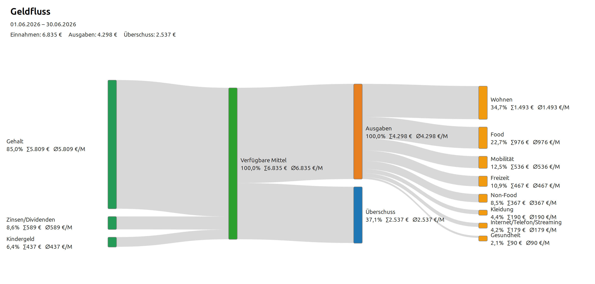
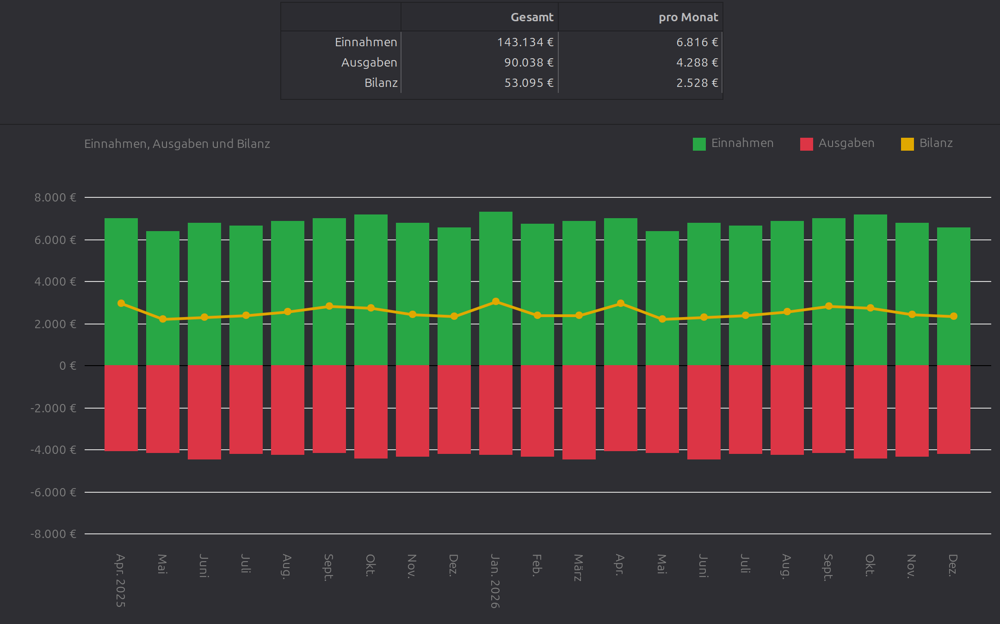
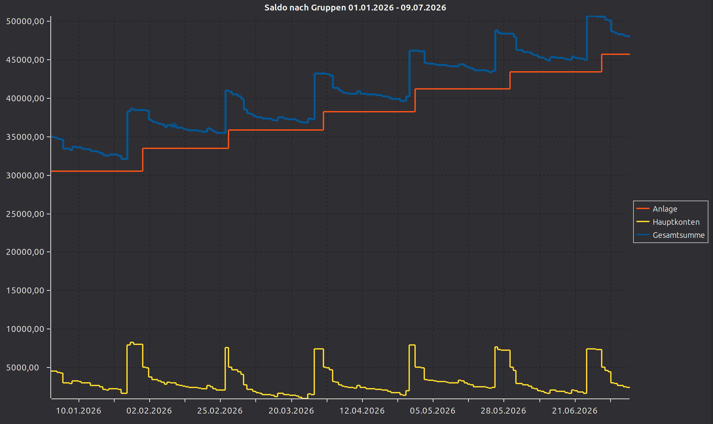
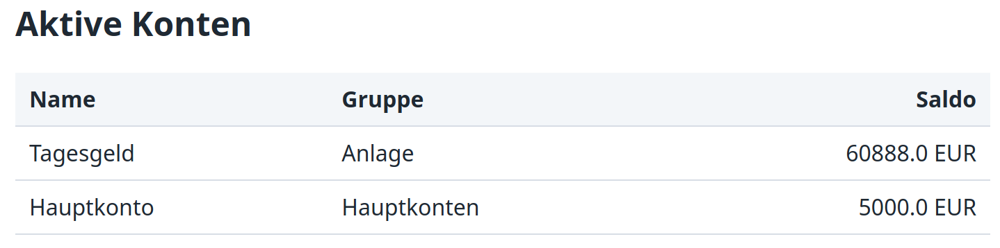
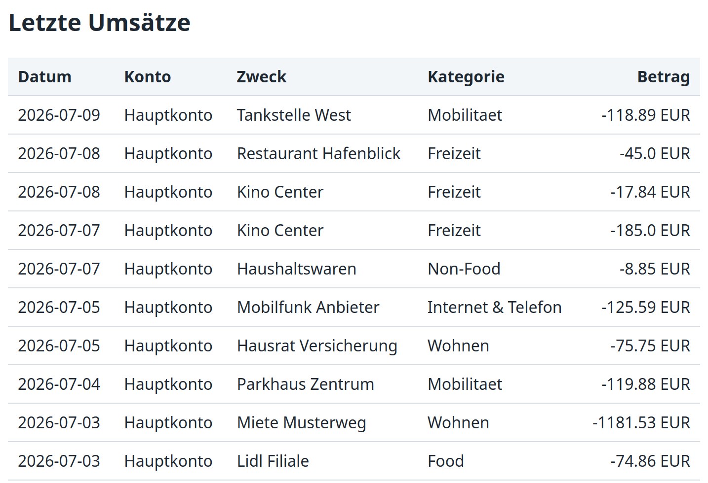

# hibiscus.ly.reports

Interaktive Auswertungen für Hibiscus

`hibiscus.ly.reports` erweitert Hibiscus unter **Hibiscus -> Auswertungen** um
zusätzliche Ansichten für Sankey-Diagramme, Einnahmen, Ausgaben, Kontosalden
und eigene HTML-Reports.


# Auswertungen

* **Geldfluss**: zeigt Einnahmequellen, Ausgabenkategorien und Überschuss oder Defizit als Sankey-Diagramm.

Der Geldfluss zeigt, aus welchen Quellen Einnahmen stammen und in welche
Kategorien Ausgaben fließen. Ausgabenkategorien lassen sich per Mausklick
auf- und zuklappen. Kleine Flüsse können in den Einstellungen als
**Sonstige** gebündelt werden.

* **Monatsübersicht**: stellt Einnahmen, Ausgaben und Bilanz als Zeitreihe dar;
  wahlweise monatlich, quartalsweise oder jährlich gruppiert.

Die Monatsübersicht zeigt Einnahmen als positive Balken, Ausgaben als negative
Balken und die Bilanz als Linie. 

* **Saldo nach Gruppen**: zeigt die taggenauen Salden von Kontogruppen als
  Linienchart inklusive Gesamtsumme.

Diese Ansicht fasst Kontosalden nach Hibiscus-Kontogruppen zusammen. Konten
ohne Gruppenzuordnung erscheinen unter **Ohne Gruppe**. Bei **Alle Gruppen**
wird zusätzlich die Gesamtsumme angezeigt. 

* **Reports**: rendert eigene HTML-Templates mit Konten, Kontogruppen und
  Umsätzen aus Hibiscus.


# Reports
Einzelne Fragmente für die HTML-Reports

        <h2>Aktive Konten</h2>

          <table>
            <thead>
              <tr>
                <th>Name</th>
                <th>Gruppe</th>
                <th>Aktualisiert</th>
                <th class="number">Saldo</th>
              </tr>
            </thead>
            <tbody>
              
              <tr>
                <td>{{ konto.name }}</td>
                <td>{{ konto.gruppe }}</td>
                <td>{{ konto.aktualisiert }}</td>
                <td class="number">{{ konto.saldo }} EUR</td>
              </tr>
              
            </tbody>
          </table>




          <h2>Letzte Umsätze</h2>

          <table>
            <thead>
              <tr>
                <th>Datum</th>
                <th>Konto</th>
                <th>Zweck</th>
                <th>Kategorie</th>
                <th class="number">Betrag</th>
              </tr>
            </thead>
            <tbody>
              
              <tr>
                <td>{{ umsatz.datum }}</td>
                <td>{{ umsatz.konto.name }}</td>
                <td>{{ umsatz.zweck }}</td>
                <td> {{ umsatz.kategorie }} </td>
                <td class="number">{{ umsatz.betrag }} EUR</td>
              </tr>
              
            </tbody>
          </table>

Die Reports-Ansicht rendert eigene HTML-Dateien als dynamische Auswertungen.
Die Dateien liegen im Jameica-Profil unter:

```text
<Benutzerverzeichnis>/.jameica/hibiscus.ly.reports/reports
```

Beim ersten Start wird ein Beispielreport angelegt. Weitere Reports können in
der Ansicht über **Neu** erstellt und anschließend direkt bearbeitet werden.
Die Vorschau wird im integrierten Browser angezeigt; **Speichern** schreibt das
Template zurück in den Report-Ordner.

Templates werden mit Jinjava gerendert. Verfügbar sind unter anderem:

* `konten`, `konten.aktive`, `konten.alle`
* `kontogruppen`, `kontogruppen.aktive`, `kontogruppen.alle`
* `umsaetze`, `umsaetze.alle`, `umsaetze.limit(...)`,
  `umsaetze.letzteTage(...)`, `umsaetze.zeitraum(...)`

Die vollständige Beschreibung der Template-Objekte ist in der Reports-Ansicht
über das Hilfe-Symbol oben rechts verfügbar. Zusätzlich bleibt die
Repository-Dokumentation in [REPORT_OBJECTS.md](REPORT_OBJECTS.md) erhalten.

Da Reports normales HTML ausgeben, können sie CSS, Tabellen und JavaScript
verwenden. Externe Bibliotheken wie Chart.js können per CDN eingebunden werden.

## MCP-Server

Das Plugin kann die Report-Template-Objekte auch ueber einen lokalen
MCP-Server bereitstellen. Der Server ist standardmaessig deaktiviert und
muss bewusst aktiviert werden. Ohne weitere Freigabe ist der Zugriff lesend.

Aktivierung:

* Menue **Reports -> MCP-Server...** oeffnen.
* **MCP-Server aktivieren** einschalten.
* Optional **Ueberweisungen anlegen** einschalten, wenn lokale
  SEPA-Ueberweisungsentwuerfe per MCP angelegt werden sollen.
* Port pruefen oder anpassen.
* Den angezeigten Endpoint und Bearer-Token in den MCP-Client eintragen.

Der Server bindet ausschliesslich an `127.0.0.1`. Jeder Request muss den
Header `Authorization: Bearer <token>` enthalten. Der Token kann im Dialog neu
erzeugt werden. Endpoint und Token koennen im Dialog per Button in die
Zwischenablage kopiert werden.

Der Token wird in der normalen Jameica-Konfiguration im Benutzerprofil
gespeichert: Klasse `de.open4me.hibiscus.reports.mcp.McpSettings`, Attribut
`token`. Diese Speicherung ist nicht verschluesselt; der Schutz besteht aus
lokalem Binding, Opt-in-Aktivierung und Token-Pflicht.

Beispiel:

```text
Endpoint: http://127.0.0.1:37653/mcp
Header:   Authorization: Bearer <token>
```

Verfuegbare Tools:

* `hibiscus_template_objects_list`: Top-Level-Objekte des Template-Kontexts
* `hibiscus_template_render`: Jinjava-Template-String gegen aktuelle Daten rendern
* `hibiscus_accounts_list`: aktive oder alle Konten auflisten
* `hibiscus_account_groups_list`: aktive oder alle Kontogruppen auflisten
* `hibiscus_transactions_list`: Umsaetze mit Zeitraum, Konto und Limit laden
* `hibiscus_sepa_transfer_create`: lokalen SEPA-Ueberweisungsentwurf anlegen

Objekte, die andere Plugins per `hibiscus.ly.reports.template.context`
bereitstellen, sind im MCP-Kontext ebenfalls verfuegbar. Das Report-Plugin
muss diese Plugins dafuer nicht direkt kennen.

`hibiscus_sepa_transfer_create` sendet keine Zahlung an die Bank. Es speichert
nur einen lokalen Entwurf in Hibiscus. Der Auftrag muss anschliessend in
Hibiscus geprueft und manuell ausgefuehrt werden. Das Tool funktioniert nur,
wenn im MCP-Dialog **Ueberweisungen anlegen** aktiviert wurde.

Plugins koennen zusaetzlich eigene strukturierte MCP-Tools registrieren. Wenn
zum Beispiel der Depotviewer installiert ist, koennen dadurch Tools wie
`depotviewer_depots_list`, `depotviewer_portfolio_list` oder
`depotviewer_orders_list` in Codex erscheinen.


## Plugin über den Update-Manager installieren

* Menü **Datei/Einstellungen** öffnen.
* Reiter **Updates** auswählen.
* Falls `https://www.open4me.de/hibiscus/` noch nicht aufgeführt ist:
  * **Neues Repository hinzufügen** wählen.
  * `https://www.open4me.de/hibiscus/` eintragen.
* Doppelklick auf `https://www.open4me.de/hibiscus/`.
* `hibiscus.ly.reports` auswählen und die Installation starten.
* Jameica neu starten.

## Plugin aus einer ZIP-Datei installieren

Alternativ kann das Plugin als ZIP-Datei über den Jameica-Plugin-Manager
installiert werden. Danach Jameica neu starten.

# Nach der Installation

Die Auswertungen befinden sich in Hibiscus unter **Auswertungen**:

* **Geldfluss**
* **Monatsübersicht**
* **Saldo nach Gruppen**
* **Reports**

Die Ansichten verwenden ausschließlich die in Hibiscus gespeicherten Daten.
Vorgemerkte Umsätze werden in Geldfluss und Monatsübersicht nicht
berücksichtigt. Kategorien, die in Hibiscus für Auswertungen ignoriert werden,
werden ebenfalls ausgelassen.


# Lizenz

Dieses Plugin steht unter der GNU General Public License Version 3. Details
stehen in [LICENSE](LICENSE).
