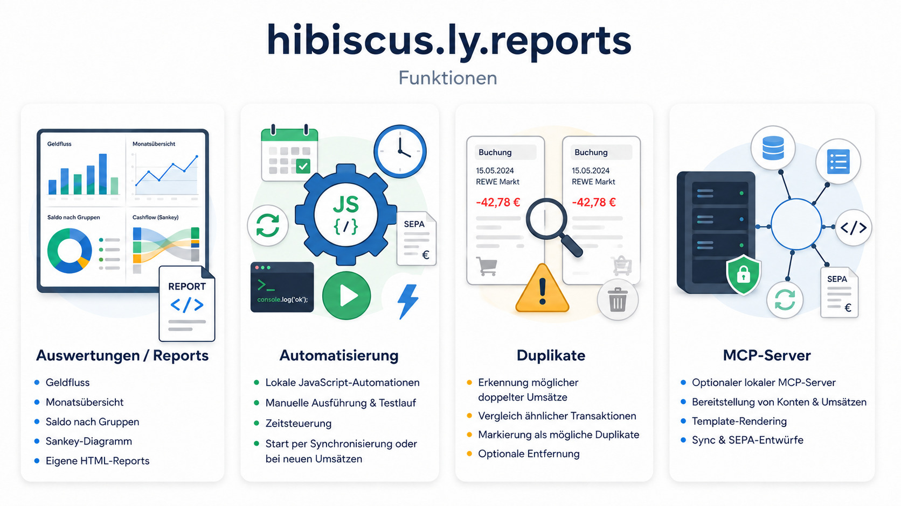

# hibiscus.ly.reports

`hibiscus.ly.reports` erweitert Hibiscus/Jameica um interaktive Auswertungen,
eigene HTML-Reports, lokale JavaScript-Automatisierungen, Duplikats-Erkennung
und einen optionalen lokalen MCP-Server.

## Funktionen und Dokumentation

- **Auswertungen und Reports**: Geldfluss, Monatsübersicht, Saldo nach
  Gruppen sowie eigene HTML-/Jinjava-Reports mit Hibiscus-Daten.
  Details: [README_REPORTS.md](README_REPORTS.md)
- **Automatisierung**: lokale JavaScript-Automationen, manuelle Ausführung,
  Startseiten-Boxen, Testläufe, Zeitsteuerung, Dialoge, `sync` und
  Zahlungsentwürfe.
  Details: [README_AUTOMATION.md](README_AUTOMATION.md)
- **Duplikats-Erkennung**: sucht mögliche doppelte Umsätze im gewählten
  Zeitraum, wahlweise über alle aktiven Konten oder ein einzelnes aktives
  Konto, mit Detailansicht und Löschfunktion.
  Details: [README_DUPLICATES.md](README_DUPLICATES.md)
- **MCP-Server**: optionaler lokaler Zugriff für MCP-Clients mit Tools für
  Konten, Umsätze, Template-Rendering, Sync und SEPA-Entwürfe.
  Details: [README_MCP.md](README_MCP.md)
- **Entwicklung und Erweiterungen**: Extension-Points für Template-Objekte
  und MCP-Tools.
  Details: [DEVELOPMENT.md](DEVELOPMENT.md)

## Installation

### Über den Update-Manager

- In Jameica **Datei/Einstellungen** öffnen.
- Reiter **Updates** auswählen.
- Falls `https://www.open4me.de/hibiscus/` noch nicht aufgeführt ist:
  **Neues Repository hinzufügen** wählen und die URL eintragen.
- Repository öffnen, `hibiscus.ly.reports` auswählen und installieren.
- Jameica neu starten.

# Lizenz

Dieses Plugin steht unter der GNU General Public License Version 3. Details
stehen in [LICENSE](LICENSE).

# Erfahrungen
## Paypal
Paypal übermittelt extrem rudimentäre Daten: Die Paypal-Umsätze erhalten nur den Namen des Gegenübers bzw. Händlers. Ein Verwendungszweck oder weitere Detailinformationen fehlen. Zwischensummen werden nicht übermittelt. Den Buchungen ist, wie auch in der PayPal-App, nicht zu entnehmen, wie sie bezahlt wurden (z.B. per Guthaben, Lastschrift, Kreditkarte).
