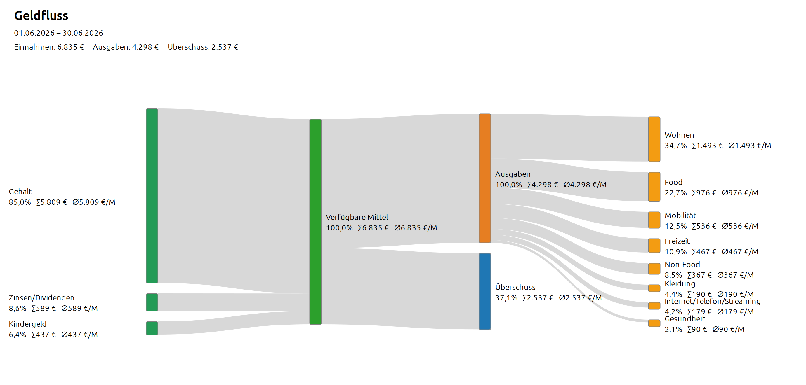
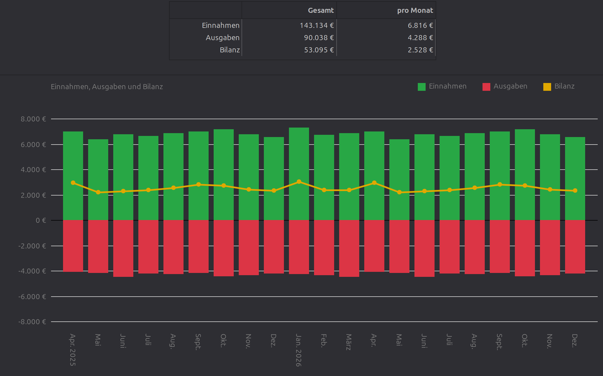
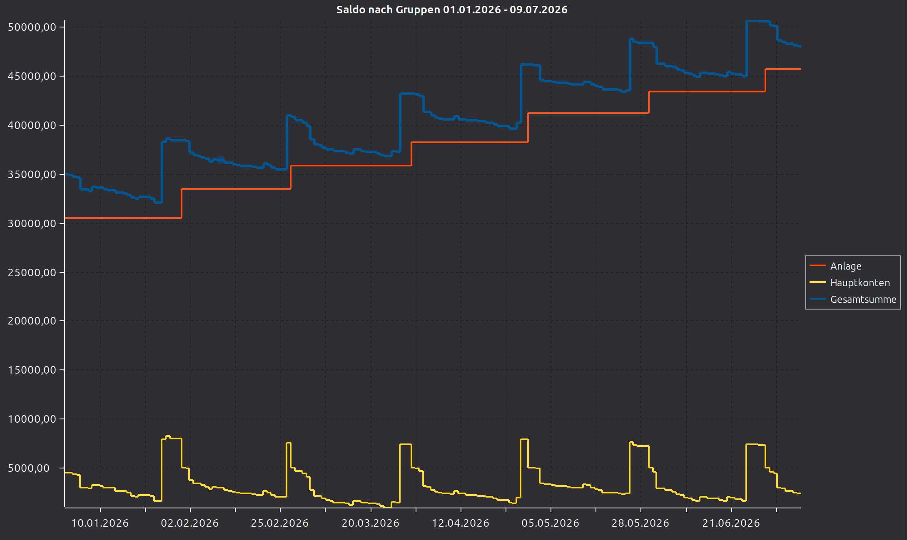
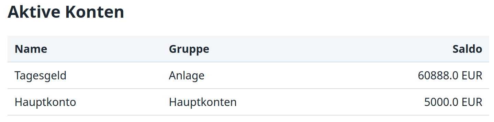
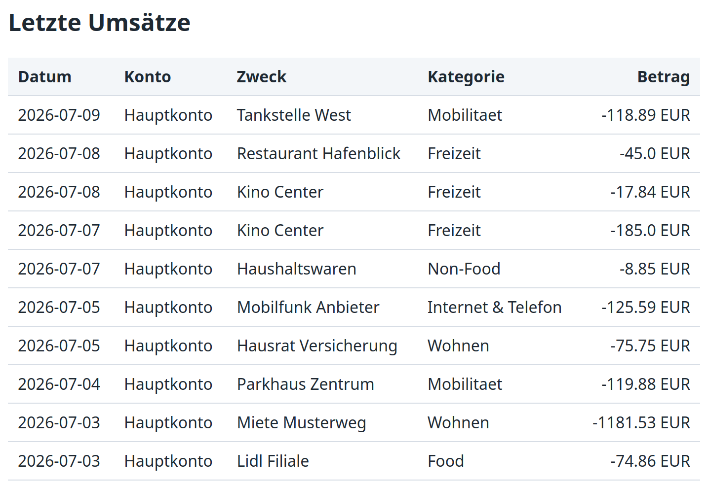

# Reports und Auswertungen

`hibiscus.ly.reports` bringt drei feste Auswertungen und dynamische
HTML-Reports für eigene Sichten auf Hibiscus-Daten mit.

## Auswertungen

### Geldfluss



Der Geldfluss zeigt, aus welchen Quellen Einnahmen stammen und in welche
Kategorien Ausgaben fließen. Ausgabenkategorien lassen sich per Mausklick
auf- und zuklappen. Kleine Flüsse können in den Einstellungen als
**Sonstige** gebündelt werden.

### Monatsübersicht



Die Monatsübersicht stellt Einnahmen, Ausgaben und Bilanz als Zeitreihe dar;
wahlweise monatlich, quartalsweise oder jährlich gruppiert. Einnahmen werden
als positive Balken, Ausgaben als negative Balken und die Bilanz als Linie
dargestellt.

### Saldo nach Gruppen



Diese Ansicht fasst Kontosalden nach Hibiscus-Kontogruppen zusammen. Konten
ohne Gruppenzuordnung erscheinen unter **Ohne Gruppe**. Bei **Alle Gruppen**
wird zusätzlich die Gesamtsumme angezeigt.

## Dynamische HTML-Reports

Reports sind HTML-Dateien, die mit Jinjava gerendert werden. Sie können CSS,
Tabellen und JavaScript enthalten. Externe Bibliotheken wie Chart.js können
per CDN eingebunden werden.

Die Dateien liegen im Jameica-Profil unter:

```text
<Benutzerverzeichnis>/.jameica/hibiscus.ly.reports/reports
```

Beim ersten Start wird ein Beispielreport angelegt. Weitere Reports können in
der Reports-Ansicht über **Neu** erstellt, direkt bearbeitet, umbenannt und
gelöscht werden. Die Vorschau wird im integrierten Browser angezeigt;
**Speichern** schreibt das Template zurück in den Report-Ordner.

Reports werden im Jameica-Navigationsbaum unter **Reports** angezeigt. Namen
mit `/` oder `\` werden als Ordnerstruktur dargestellt. Jeder Report steht
zusätzlich als Element für die Jameica-Startseite zur Verfügung. Über
**Startseite anpassen** können einzelne Reports aktiviert, sortiert und in der
Höhe angepasst werden.

## Kurze Beispiele

Aktive Konten:

```jinja
<table>
  <thead>
    <tr>
      <th>Name</th>
      <th>Gruppe</th>
      <th>Aktualisiert</th>
      <th>Saldo</th>
    </tr>
  </thead>
  <tbody>
    
    <tr>
      <td>{{ konto.name }}</td>
      <td>{{ konto.gruppe }}</td>
      <td>{{ konto.aktualisiert }}</td>
      <td>{{ konto.saldo }} EUR</td>
    </tr>
    
  </tbody>
</table>
```



Letzte Umsätze:

```jinja
<table>
  <thead>
    <tr>
      <th>Datum</th>
      <th>Konto</th>
      <th>Zweck</th>
      <th>Kategorie</th>
      <th>Betrag</th>
    </tr>
  </thead>
  <tbody>
    
    <tr>
      <td>{{ umsatz.datum }}</td>
      <td>{{ umsatz.konto.name }}</td>
      <td>{{ umsatz.zweck }}</td>
      <td>{{ umsatz.kategorie }}</td>
      <td>{{ umsatz.betrag }} EUR</td>
    </tr>
    
  </tbody>
</table>
```



## Jinjava

Jinjava ist eine Java-Implementierung, die einen Teil der Template-Befehle von
Jinja unterstützt. Reports nutzen diese Syntax für Schleifen, Bedingungen,
Variablen und Filter.

Direkte Iteration über `konten`, `kontogruppen` oder `umsaetze` verwendet die
Standardauswahl. Bei Konten und Kontogruppen sind das aktive Konten. Bei
Umsätzen sind das die letzten 90 Tage.

```jinja

  {{ konto.name }}: {{ konto.saldo }}

```

## Top-Level-Objekte

| Objekt | Bedeutung |
| --- | --- |
| `konten` | Aktive Konten |
| `konten.aktive` | Aktive Konten |
| `konten.alle` | Alle Konten |
| `kontogruppen` | Gruppen der aktiven Konten |
| `kontogruppen.aktive` | Gruppen der aktiven Konten |
| `kontogruppen.alle` | Gruppen aller Konten |
| `umsaetze` | Umsätze der letzten 90 Tage |
| `umsaetze.alle` | Alle Umsätze |

Objekte, die andere Plugins per `hibiscus.ly.reports.template.context`
bereitstellen, sind ebenfalls verfügbar.

## Konten

Ein Konto besitzt folgende Felder:

| Feld | Bedeutung |
| --- | --- |
| `konto.id` | Interne Hibiscus-ID |
| `konto.name` | Anzeigename des Kontos |
| `konto.bezeichnung` | Hibiscus-Bezeichnung |
| `konto.blz` | Bankleitzahl |
| `konto.kontonummer` | Kontonummer |
| `konto.kundennummer` | Kundennummer |
| `konto.kundenkennung` | Alias für Kundennummer |
| `konto.iban` | IBAN |
| `konto.gruppe` | Kontogruppe |
| `konto.accountType` | Hibiscus-Kontotyp, falls bekannt |
| `konto.backendClass` | Synchronisierungs-Backend-Klasse |
| `konto.saldo` | Kontosaldo, auf zwei Nachkommastellen gerundet |
| `konto.verfuegbar` | Verfügbarer Betrag, auf zwei Nachkommastellen gerundet |
| `konto.aktualisiert` | Datum und Uhrzeit der letzten Saldo-Aktualisierung |
| `konto.aktiv` | `true`, wenn das Konto in Hibiscus nicht deaktiviert ist |
| `konto.offline` | `true`, wenn es ein Hibiscus-Offline-Konto ist |
| `konto.depot` | `true`, wenn der Kontotyp als Depot/Fonds erkannt wird |
| `konto.umsaetze` | Umsätze dieses Kontos |

Alle Konten, auch inaktive:

```jinja

  {{ konto.name }}

```

## Kontogruppen

Kontogruppen werden aus `konto.gruppe` gebildet. Konten ohne Gruppe werden der
Gruppe `Ohne Gruppe` zugeordnet.

| Feld | Bedeutung |
| --- | --- |
| `gruppe.name` | Name der Kontogruppe |
| `gruppe.konten` | Konten dieser Gruppe |
| `gruppe.anzahl` | Anzahl der Konten in dieser Gruppe |
| `gruppe.saldo` | Summe der Salden, auf zwei Nachkommastellen gerundet |
| `gruppe.verfuegbar` | Summe der verfügbaren Beträge, auf zwei Nachkommastellen gerundet |

Beispiel:

```jinja

  <h2>{{ gruppe.name }}</h2>
  <p>{{ gruppe.anzahl }} Konten, {{ gruppe.saldo }} EUR</p>

  <ul>
    
      <li>{{ konto.name }}: {{ konto.saldo }} EUR</li>
    
  </ul>

```

## Umsätze

Der Standardzugriff auf `umsaetze` ist auf die letzten 90 Tage begrenzt. Für
große Datenbestände sollte zusätzlich `limit(...)` verwendet werden.

Ein Umsatz besitzt folgende Felder:

| Feld | Bedeutung |
| --- | --- |
| `umsatz.datum` | Buchungsdatum |
| `umsatz.valuta` | Valutadatum |
| `umsatz.betrag` | Buchungsbetrag |
| `umsatz.saldo` | Kontosaldo nach der Buchung |
| `umsatz.zweck` | Verwendungszweck |
| `umsatz.zweck2` | Zweite Zweckzeile |
| `umsatz.verwendungszwecke` | Weitere Verwendungszwecke als Liste |
| `umsatz.gegenkontoName` | Name des Gegenkontos |
| `umsatz.gegenkontoNummer` | Nummer des Gegenkontos |
| `umsatz.gegenkontoBlz` | BLZ des Gegenkontos |
| `umsatz.art` | Buchungsart |
| `umsatz.kategorie` | Name der zugeordneten Kategorie |
| `umsatz.kategoriePfad` | Kategoriepfad als Liste |
| `umsatz.vorgemerkt` | `true`, wenn der Umsatz vorgemerkt ist |
| `umsatz.konto` | Konto dieses Umsatzes |

## Umsatz-Filter

| Ausdruck | Bedeutung |
| --- | --- |
| `umsaetze` | Umsätze der letzten 90 Tage |
| `umsaetze.alle` | Alle Umsätze |
| `umsaetze.limit(100)` | Maximal 100 Umsätze |
| `umsaetze.letzteTage(30)` | Umsätze der letzten 30 Tage |
| `umsaetze.zeitraum("2026-01-01", "2026-01-31")` | Umsätze im angegebenen Zeitraum |

Filter können kombiniert werden:

```jinja

  {{ umsatz.datum }} {{ umsatz.betrag }} {{ umsatz.zweck }}

```

Kontospezifische Umsätze:

```jinja

  <h2>{{ konto.name }}</h2>

  
    {{ umsatz.datum }} {{ umsatz.betrag }} {{ umsatz.zweck }}
  

```

## Kategorien

`umsatz.kategoriePfad` enthält die Kategorie-Hierarchie. Ein Eintrag besitzt:

| Feld | Bedeutung |
| --- | --- |
| `kategorie.id` | Interne Hibiscus-ID |
| `kategorie.name` | Name der Kategorie |
| `kategorie.skipReports` | `true`, wenn die Kategorie in Auswertungen ignoriert wird |
| `kategorie.color` | Farbe als RGB-Zahl, falls gesetzt |

Beispiel:

```jinja

  
    {{ kategorie.name }} > 
  

```

## Depotviewer

Wenn das Plugin `hibiscus.depotviewer` installiert ist, steht der Namespace
`depotviewer` zur Verfügung.

Alle Depotviewer-Listen sind Proxy-Listen. Sie können direkt iteriert werden
und bieten einheitlich `size()`, `isEmpty()`, `asList()` und `limit(...)`.

`depotviewer.depots` iteriert über aktive Depots. Mit
`depotviewer.depots.alle` können alle Depots inklusive deaktivierter Depots
geladen werden.

```jinja

  <h2>{{ depot.name }}</h2>
  <p>{{ depot.kontonummer }} {{ depot.iban }}</p>

  <h3>Bestand</h3>
  
    {{ bestand.wertpapier.name }}:
    {{ bestand.anzahl }} Stück,
    {{ bestand.wert }} {{ bestand.wertwaehrung }}
  

  <h3>Bestand am Stichtag</h3>
  
    {{ bestand.wertpapier.name }}:
    {{ bestand.wert }} {{ bestand.wertwaehrung }}
  

  <h3>Orderbuch</h3>
  
    {{ order.buchungsdatum }} {{ order.aktion }}
    {{ order.anzahl }} {{ order.wertpapier.name }}
  

```

`depotviewer.wertpapiere` enthält Wertpapiere mit aktuellem Bestand.
`depotviewer.wertpapiere.alle` enthält alle Wertpapiere aus der Stammliste.

```jinja

  
  {{ wertpapier.name }}:
  
    {{ kurs.wert }} {{ kurs.waehrung }} am {{ kurs.datum }}
  

```

Zeitreihen unterstützen zusätzlich `zeitraum("YYYY-MM-DD", "YYYY-MM-DD")`
und `letzteTage(...)`.

```jinja

  {{ order.buchungsdatum }} {{ order.wertpapier.name }} {{ order.aktion }}



  {{ kurs.datum }} {{ kurs.wert }} {{ kurs.waehrung }}

```

## Hinweise

- Datumswerte werden im Format `YYYY-MM-DD` ausgegeben.
  `konto.aktualisiert` enthält zusätzlich die Uhrzeit im Format
  `YYYY-MM-DDTHH:MM:SS`.
- Geldwerte sind Zahlen. Bei Konten und Kontogruppen sind Saldo und
  verfügbarer Betrag bereits auf zwei Nachkommastellen gerundet.
- `umsaetze.alle` kann bei großen Hibiscus-Datenbeständen sehr viele Daten
  laden. Für Reports ist meist ein Zeitraum plus `limit(...)` sinnvoller.
- Der gleiche Template-Kontext ist auch in Automatisierungen und über den
  MCP-Server nutzbar. Details stehen in [README_AUTOMATION.md](README_AUTOMATION.md)
  und [README_MCP.md](README_MCP.md).
